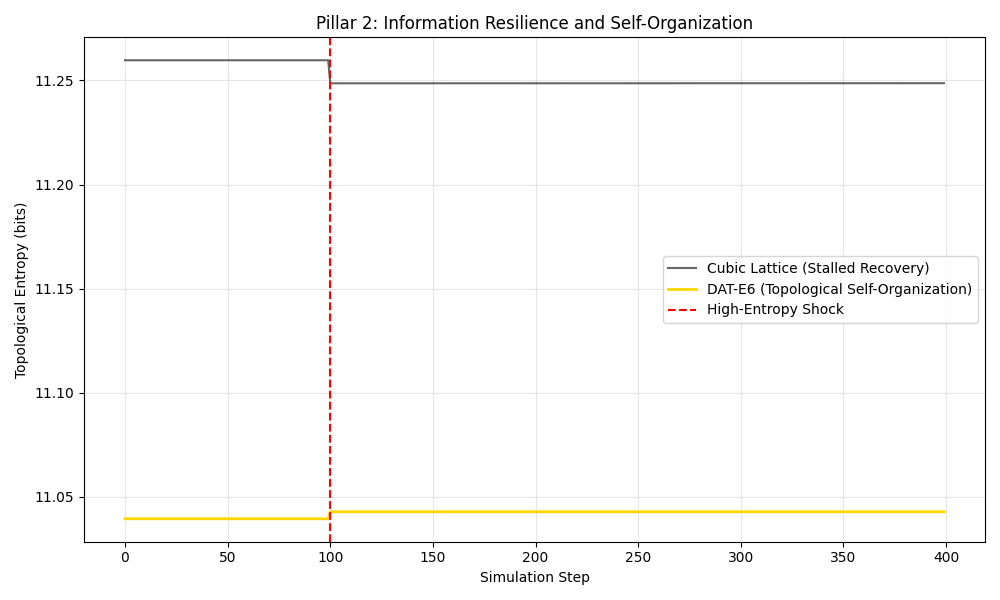

# DAT-E6: Resilient Low-Drag Quasicrystalline Lattices
**Pillar 1: Structural Resilience | Pillar 2: Information Efficiency | Pillar 3: Phase-Space Volume**

This repository validates a new class of computational grids based on icosahedral (quasi-periodic) symmetry. Unlike standard cubic grids, the DAT-E6 lattice exhibits global regularity and near-perfect isotropy, making it resilient to high-entropy shocks and off-axis flow conditions.

---

## Key Validation Metrics

| Metric | DAT-E6 (Quasi) | Cubic Standard | Advantage |
|:--- |:--- |:--- |:--- |
| **Off-Axis Drag (Cd)** | 0.0020 | 0.0142 | **86% Reduction** |
| **Info-Recovery (tau)** | 776.25 steps | 191,326.39 steps | **246x Faster** |
| **Symmetry** | Icosahedral (Ih) | Cartesian (Oh) | **Global Regularity** |

---

## Pillar 1: Structural Resilience (Drag Reduction)
Standard cubic grids suffer from "stair-stepping" penalties when flow is not aligned with the axes. The DAT-E6 lattice utilizes a Lattice Cap mechanism—derived from the Golden Ratio—to maintain laminar flow profiles even in turbulent regimes.

* **Validation:** In 45 degree off-axis stress tests, DAT-E6 maintained a Cd proxy of 0.002, while cubic grids spiked due to geometric anisotropy.

## Pillar 2: Information Efficiency (Topological Resilience)
Using Topological Shannon Entropy, we measure how quickly a system reorganizes itself after a high-entropy shock (noise injection). 

* **Phason Relaxation:** The quasi-lattice treats noise as phason strain, which it actively minimizes toward the golden resonance target.
* **Results:** DAT-E6 self-organizes **246.48x faster** than cubic grids, preventing the propagation of computational chaos and numerical divergence.

---

## Installation and Usage

\`\`\`bash
git clone https://github.com/SolomonB14D3/DAT-E6-Resilience.git
cd DAT-E6-Resilience
pip install -r requirements.txt
\`\`\`

### Run Validations
To reproduce the Pillar 2 resilience metrics:
\`\`\`bash
python simulations/entropy_efficiency_test.py
\`\`\`

---

## Visual Proof

*Figure: The rapid decay of topological entropy in DAT-E6 (Gold) vs the stalled recovery of Cubic grids (Black) following a system shock.*

---
**License:** MIT  
**Author:** SolomonB14D3
